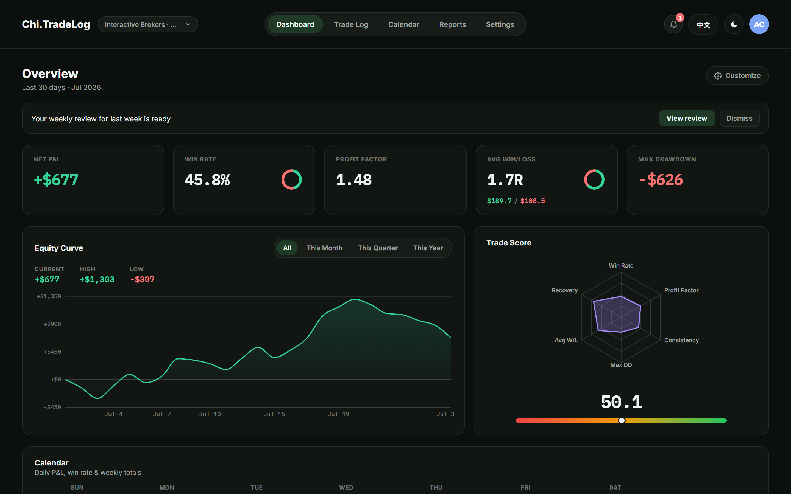
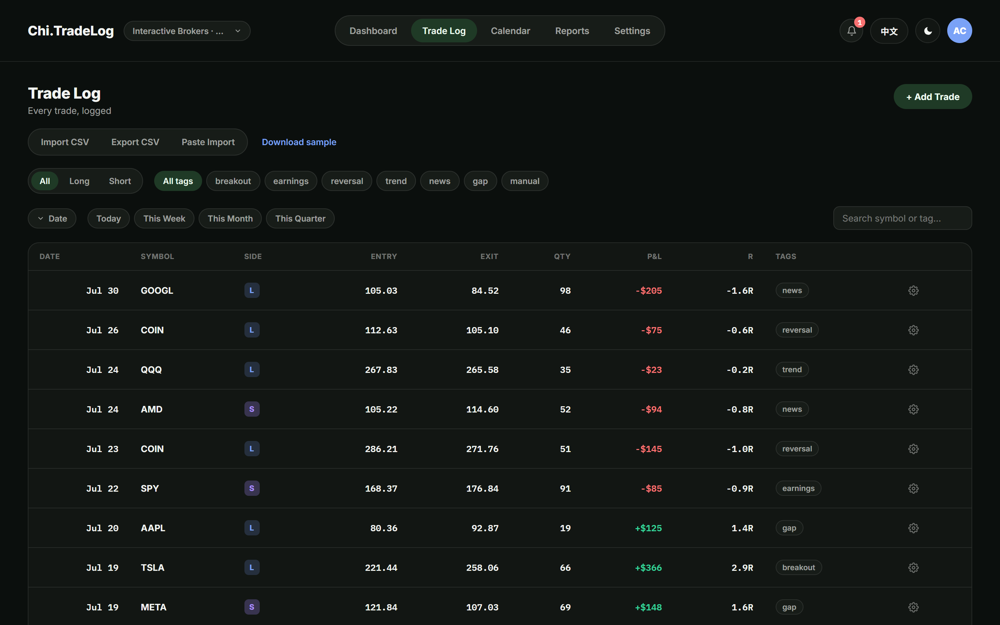
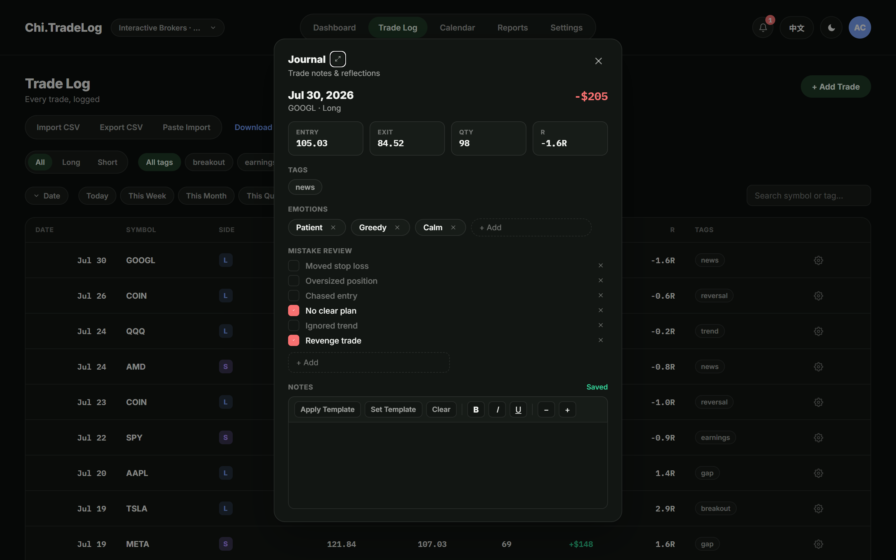
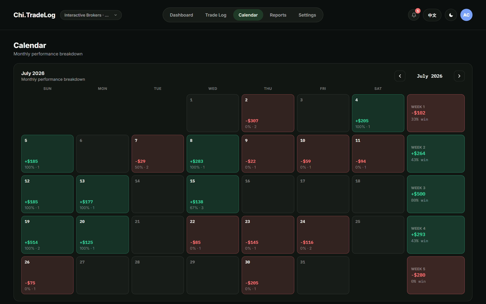
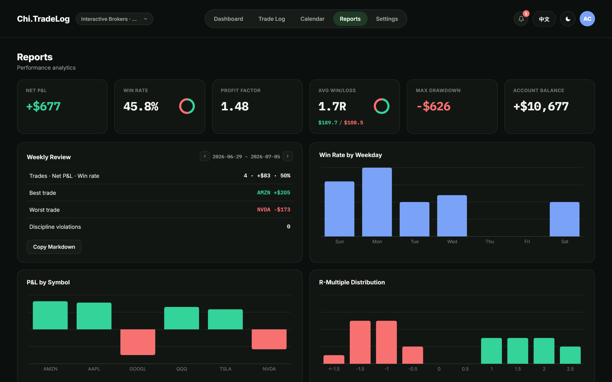
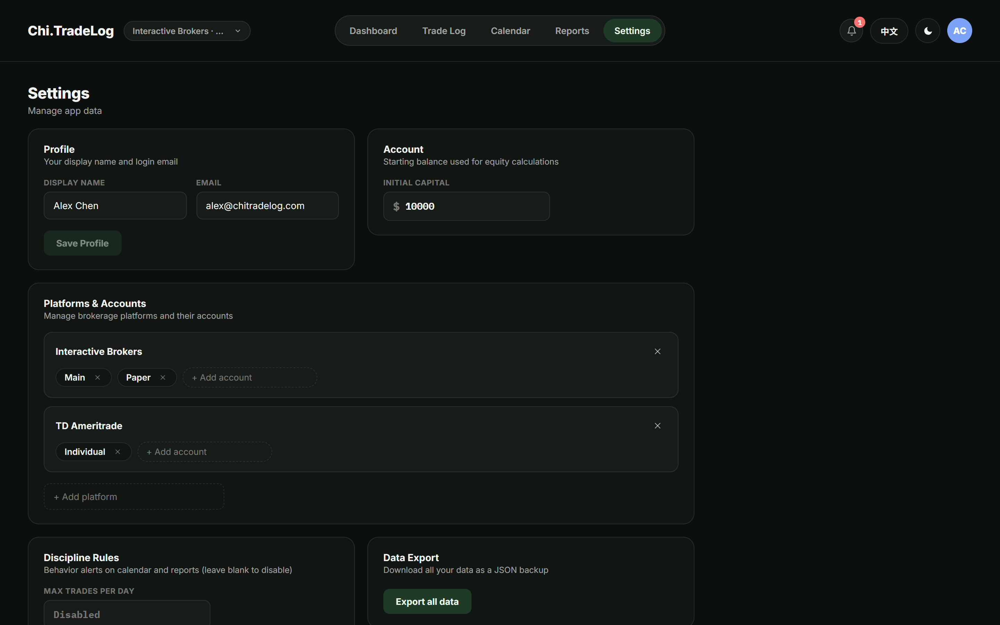

# Chi.TradeLog

**一個幫你把「交易紀錄」變成「交易能力」的交易日記 / 績效分析 Web App。**

多數交易者輸在同樣的錯誤重複發生——追高、凹單、報復性交易。Chi.TradeLog 的核心理念很簡單：**把每一筆交易記下來、每一天檢討自己，讓數據告訴你問題出在哪。**



## 這個 App 能做什麼？

### 📊 Dashboard — 一眼看懂你的交易狀態

打開就是重點：淨損益、勝率、獲利因子、平均賺賠比（R）、最大回落，搭配權益曲線（可切換全部／本月／本季／本年）與六維 Trade Score 雷達圖。每週一還會自動生成上週回顧報告，提醒你檢視。

### 📝 Trade Log — 每一筆交易都有紀錄

手動新增、CSV 匯入匯出，或直接從券商複製成交明細**貼上匯入**。支援標籤分類、多空篩選、日期區間、關鍵字搜尋。每筆交易可記錄停損價，自動算出**真實 R 值**（風險報酬比）。



### ✍️ 交易日記 — 檢討才是成長的開始

點任一筆交易就能寫日記：當下的**情緒標籤**（貪婪、恐懼、冷靜⋯）、**錯誤檢討清單**（移動停損、追價進場、報復性交易⋯）、自由筆記（支援個人範本，一鍵套用）。當天有交易卻還沒寫日記時，右上角的鈴鐺會提醒你。



### 📅 P&L 月曆 — 哪天賺哪天賠，一目了然

以月曆呈現每日損益與勝率、每週小計，快速定位「出事的那幾天」，點進去看當天細節。



### 📈 報表分析 — 讓數據說話

- **績效報表**：月度損益、星期別勝率、標的與標籤表現。
- **進階統計**：連勝／連敗、期望值、最佳／最差交易日、進出場時段分析。
- **行為分析**：情緒 × 績效交叉分析、每種錯誤的實際成本統計。
- **紀律檢核**：單日交易筆數上限、報復性交易偵測，違規即提示。



### ⚙️ 設定 — 多使用者、多帳戶、資料自主

管理員可建立多位使用者，**每個人的資料完全隔離**。每位使用者可管理自己的券商平台與帳戶、自訂標籤與商品、一鍵**匯出全部資料**（JSON）備份。



### 其他貼心設計

- 🌗 深色／淺色主題（深色為預設）
- 🌐 介面支援英文／繁體中文即時切換
- 📱 響應式版面，桌機平板都能用

## 快速開始

只需要安裝 [Docker](https://www.docker.com/products/docker-desktop/)，三個指令內開好整套服務（資料庫 + 後端 + 前端）：

```bash
git clone <this-repo>
cd Chi.TradeLog
docker compose up -d --build
```

- 打開前端：<http://localhost:8080>
- 後端 API：<http://localhost:5079>
- 資料庫 schema 會在後端啟動時自動建立並植入示範資料

**示範帳號**：`alex@chitradelog.com` / `demo1234`（管理員）

> **Windows 使用者**：雙擊根目錄的 `start-tradelog.bat` 即可一鍵完成「啟動 Docker → 啟動服務 → 打開瀏覽器」。

### 想先試玩、不想裝 Docker？

前端內建確定性示範資料（mock 模式），單獨跑起來就能體驗完整 UI：

```bash
cd frontend
npm install
npm run dev        # http://localhost:5173，免登入、免後端
```

## 技術架構

前後端分離的 Monorepo，三個容器一組：

```
┌──────────────┐      ┌───────────────────┐      ┌──────────────┐
│   frontend   │ ───▶ │      backend      │ ───▶ │   postgres   │
│ React SPA    │ HTTP │ ASP.NET Core API  │ SQL  │ PostgreSQL 17│
│ (nginx :8080)│      │ (.NET 10 :5079)   │      │              │
└──────────────┘      └───────────────────┘      └──────────────┘
```

| 分區 | 技術選型 | 為什麼 |
| --- | --- | --- |
| 後端 | ASP.NET Core（.NET 10 LTS）、Controller-based Web API | 長期支援版本、分層清晰（Api / Services / Repositories / Common） |
| 資料存取 | PostgreSQL + Dapper + FluentMigrator | 輕量 SQL 直寫、schema 版本化遷移、啟動時自動套用 |
| 認證 | JWT Bearer + BCrypt | 無狀態驗證、密碼雜湊儲存，權杖 12 小時自動換發 |
| 前端 | React + TypeScript + Vite | 型別安全、開發體驗快 |
| 狀態管理 | Zustand（UI 偏好）＋ TanStack Query（伺服器資料） | 兩種狀態各司其職，不互相污染 |
| 樣式 | CSS 變數 design tokens + CSS Modules | 主題切換零成本、樣式作用域隔離 |
| 圖表 | Recharts | 權益曲線、雷達圖、報表視覺化 |
| 國際化 | react-i18next | EN／繁中雙語，文案集中管理 |
| 測試 | 後端 xUnit（單元＋整合）、前端 Vitest（純函式） | 核心計算邏輯前後端各有一套測試護住 |

### 後端架構設計

後端採**分層架構（Layered Architecture）**，拆成四個專案：

```
backend/src/
├─ Chi.TradeLog.Api            # API 層：Controllers、FluentValidation、Middleware、JWT / Swagger / DI 組態
├─ Chi.TradeLog.Services       # 業務邏輯層：運算與決策
├─ Chi.TradeLog.Repositories   # 資料存取層：Dapper SQL、FluentMigrator migrations
└─ Chi.TradeLog.Common         # 共用層：Options、Enum、Extensions
```

每一層有專屬的資料模型，不跨層混用，物件轉換交給 AutoMapper：

```
Client ──Parameter──▶ Controller ──InfoModel──▶ Service ──Condition──▶ Repository ──▶ PostgreSQL
Client ◀──ViewModel── Controller ◀────Dto────── Service ◀──DataModel── Repository ◀──┘
```

| 面向 | 作法 |
| --- | --- |
| 資料存取 | Dapper 手寫 SQL，查詢成本透明 |
| Schema 管理 | FluentMigrator 版本化遷移（13 個 migrations），啟動時自動套用 |
| 多租戶隔離 | 使用者身分來自 JWT claim，`user_id` 過濾下沉到 Repository 層每一句 SQL |
| 認證 | JWT Bearer（12 小時效期＋自動換發）＋ BCrypt 密碼雜湊，管理員用 claim-based policy |
| 機密管理 | 全部外部化到環境變數；正式環境偵測到開發用金鑰會直接拒絕啟動（fail-fast） |
| 錯誤處理 | 統一例外處理 middleware，回應格式一致 |
| 輸入驗證 | 每個寫入端點都有對應的 FluentValidation validator |
| API 文件 | Swagger + XML 註解自動生成 |
| 測試 | 44 個 xUnit 測試：Service 單元測試 + WebApplicationFactory 端點整合測試（不依賴真實資料庫） |

## 這個專案怎麼開發的？— AI 協作交付

Chi.TradeLog 是一人 × AI 協作的產物：**我負責產品決策、架構方向、產品取捨與最終驗收，AI 負責大部分的程式實作**。從初始 commit 到功能完備歷時 7 天（37 個 commit：23 feat / 6 fix / 4 docs / 2 chore），後端 44 + 前端 70 個測試全綠，每個 commit 都是一項通過驗證的完整功能。

比「用了 AI」更關鍵的是**讓 AI 穩定產出生產等級程式碼的工程制度**。對話記憶不可靠、模型會更換——所以制度不放在對話裡，全部寫進 repo：

| 制度 | 落點 | 解決什麼問題 |
| --- | --- | --- |
| 分區硬規範 | `CLAUDE.md`（root / backend / frontend） | AI 動工前先讀該區規範：分層、命名、技術選型一致，不會突然冒出不一致的技術或風格 |
| 工程制度 | [`docs/ENGINEERING_SYSTEM.md`](docs/ENGINEERING_SYSTEM.md) | 驗證梯 L1–L5（靜態檢查 → 單元測試 → 建置 → 執行期實測 → 資料庫實查；**沒爬到 L4 不得宣稱完成**）、commit 制度、架構不變量（多租戶鐵律、前後端計算鏡射）、踩過的領域陷阱 |
| 計畫與交接 | `docs/plans/` | 功能先寫計畫檔（Context、分階段步驟、驗證方式），狀態走「規劃中 → 進行中 → 已完成」；被中斷的工作必須把交接狀態寫回檔案，換模型、換 session 都能無縫接手 |
| Schema 單一事實來源 | [`database/DATABASE_SCHEMA.md`](database/DATABASE_SCHEMA.md) | AI 不猜表名欄位名：動 SQL 前必讀、改 schema 後必回寫 |

制度裡的規則不是理論，是實戰教訓的沉澱（詳見 ENGINEERING_SYSTEM.md 第 3 節）：

- **期貨損益不能用價差重算**——YM 每點 $5，價差算出 $146、真實損益是 $723。教訓提煉成原則：「外部報表的金額是事實，重算是推測」。
- **券商報表的虧損常不帶負號**——盈虧方向由價差推導、金額信任報表值。
- **曾一次堆積六個階段數千行未 commit**——等於整段工程沒有還原點。現在每通過一階段驗證立即 commit。

人與 AI 的分工界線：

```
人（判斷）：做什麼功能、資料正確性優先序、產品取捨（AI 以選擇題形式提案）、最終驗收
AI（執行）：讀規範 → 寫計畫 → 分層實作 → 附測試 → 爬驗證梯 → commit → 回寫文件
```

## 目錄結構

```
Chi.TradeLog/
├─ backend/            # ASP.NET Core Web API（Api / Services / Repositories / Common 分層）
├─ frontend/           # Vite React SPA（pages / components / features / lib 分層）
├─ database/           # DATABASE_SCHEMA.md（資料庫 schema 單一事實來源）
├─ docs/               # 工程制度、實作計畫、截圖
├─ docker-compose.yml  # postgres + backend + frontend 一鍵啟動
└─ start-tradelog.bat  # Windows 一鍵啟動腳本
```

## 本機開發

```bash
# 前端（API 模式，連真後端）
docker compose up -d postgres backend
echo VITE_API_BASE_URL=http://localhost:5079 > frontend/.env
cd frontend && npm run dev

# 後端
cd backend
dotnet build
dotnet test                                   # xUnit 測試
dotnet run --project src/Chi.TradeLog.Api     # 需本機 PostgreSQL（見 appsettings.json）

# 測試
cd frontend && npm test      # Vitest（lib/ 純函式）
cd backend && dotnet test    # xUnit（service 單元 + endpoint 整合）
```

開發模式下後端提供 Swagger 文件：<http://localhost:5079/swagger>。

## 使用者管理

- 管理員登入後於 **Settings → Users** 建立／編輯／刪除使用者、重設密碼。
- 新使用者初始密碼為 `changeme123`，請提醒對方登入後於 **Settings → Password** 自行變更。
- 系統至少保留一位管理員，避免鎖死。

## 更多文件

- [`docs/ENGINEERING_SYSTEM.md`](docs/ENGINEERING_SYSTEM.md) — 開發循環、驗證梯、架構不變量
- [`database/DATABASE_SCHEMA.md`](database/DATABASE_SCHEMA.md) — 資料庫 schema 規格
- [`frontend/DESIGN_GUIDELINES.md`](frontend/DESIGN_GUIDELINES.md) — 視覺設計基準（tokens、字體、間距）
- 各區 `CLAUDE.md` — 分區開發規範

## License

本專案以 [GNU General Public License v3.0](LICENSE) 授權。你可以自由使用、修改與再發布本程式碼，但修改後的版本必須以相同條款開源。
